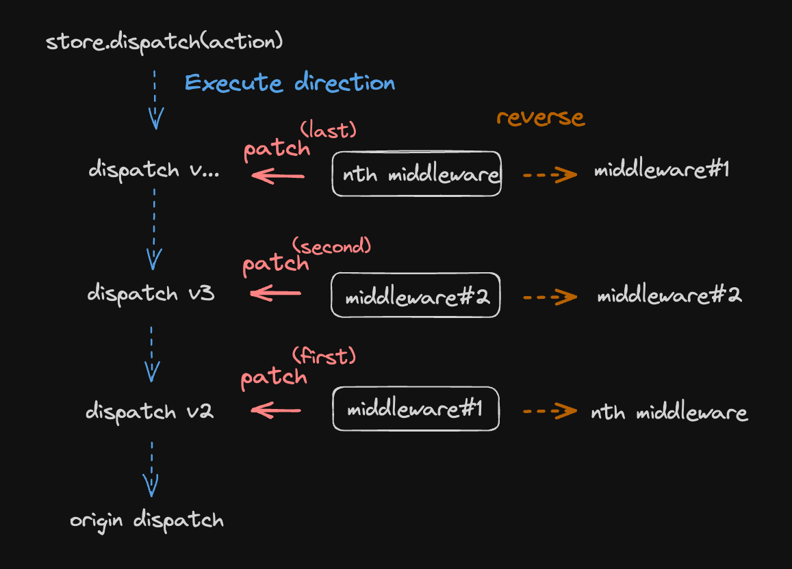
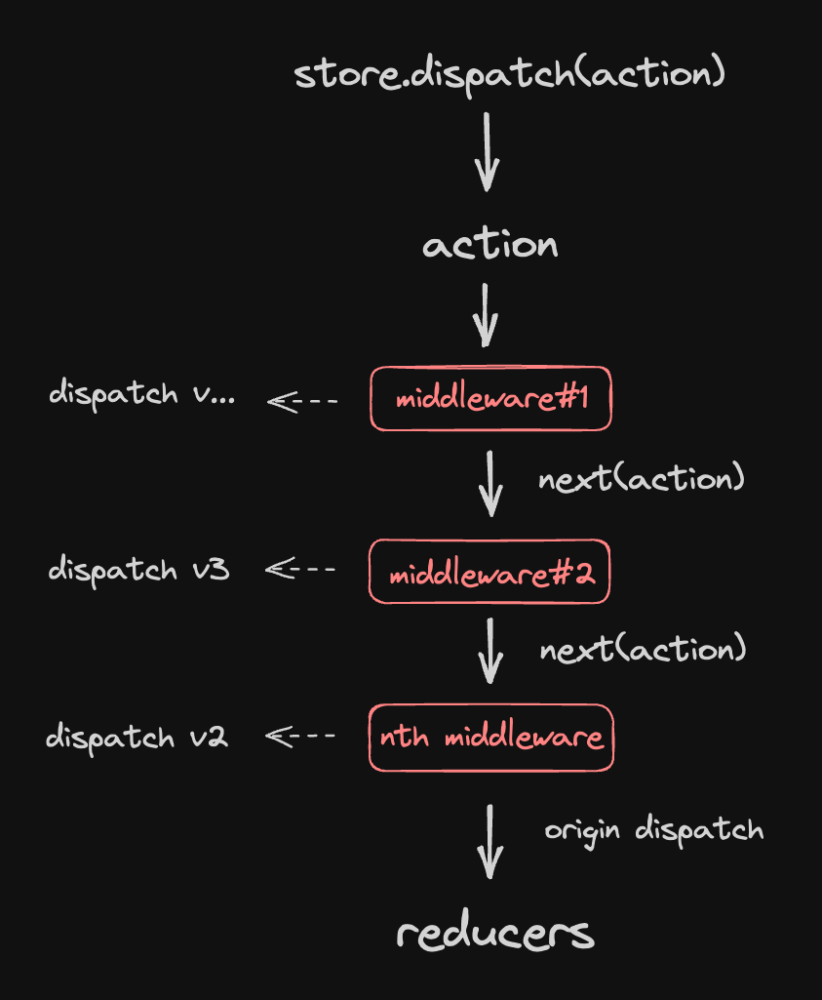

這次在團隊中負責研究並導入 redux(redux-toolkit), 預計會有一個系列由淺到深來談這個主題

- redux 的概念和使用情境
- 怎麼理解 middleware(中間件)。

<!--truncate-->

### redux 之前

近期公司正好準備要開始一個新專案, 已有的專案是使用 useContext 和 useReducer 來管理前端狀態, 但在專案規模不小的情況下, 已經感受到這樣的模式在開發上有些需要改善的地方。

#### useContext 及 useReducer

`useReducer`, 和 `useState` 有什麼不同

```jsx
const [state, setState] = useState(INITIAL);

const [state, dispatch] = useReducer(reducer, INITIAL_STATE);
```

1. setState, dispatch → 都是用於狀態更新, 前者能夠傳任意值, 後者只能傳 pure object
2. 後者多了需要使用 reducer 內定義好的方法來更新 state, 無法隨意呼叫 setState 改變 state
3. reducer 定義了狀態更新(dispatch) 可使用的種類(type), 參數(payload)。
4. useReducer 和 useContext  一併使用時能做到類似輕量化的 redux。

#### Prop Drilling:

`useContext` 讓元件之間能夠共享狀態, 並且 context 使用起來輕便, 學習曲線低的特性, 在前端狀態還不是很複雜以前很適合使用。

#### Avoid Data Mutate:

`useReducer` 讓所有更新狀態的方法被定義在 `reducer` 中, 更容易對方法除錯和測試。

解決了 React 中需要透過 `prop drilling` 的方式將狀態傳遞到深層子元件，並透過 reducer 避免開發者直接 `mutate` 資料，以減少不必要的錯誤。

### 使用 redux(redux-toolkit) 的理由

如果你沒有遇到以下的問題(需求), 也許還用不上 redux, redux-toolkit

#### Manage Global State(狀態集中管理)

useContext

```jsx
// 過多的 Context Provider, 未來如果繼續擴充, 維護的成本會逐漸增高。
<GlobalContextProvider>
  <PopUpProvider>
    <AuthProvider>
      <CartProvider>
        <Component {...pageProps} />
      </CartProvider>
    </AuthProvider>
  </PopUpProvider>
</GlobalContextProvider>
```

#### Track State Change(狀態追蹤)

即便用 useReducer 來集中管理更新狀態的方法, 頻繁更新狀態的情境不容易找到資料更新的來源(到底是誰修改了狀態, 改了什麼東西), 尤其在非同步邏輯上更加明顯

#### Re-Render(渲染效能)

context 任何一個值更新時, 所有用到 context 值的 component 都重新渲染,隨著頁面功能增加, 元件變複雜, 容易遇到效能問題。

#### Data Fetching(非同步請求)

1. 無法在 action 中處理非同步邏輯, 必須在外部先處理好, 再用回傳值更新狀態
2. side effect 職責不易切分
3. data cache, race condition 等狀況需另外處理

```jsx
// 封裝好 function 讓外部直接呼叫來更新狀態
export const updateCartItems = async () => {
  try {
    // 等待 API response
    const res = await updateCart();

    // handle success
    if (res.Success) {
      const { cart } = resp.Data;

      // 取得 response data, 依據 action type => dispatch => reducers
      dispatch({ type: CART_ACTIONS.UPDATE_CART, cart });
    } else {
      // handle failed
    }
  } catch (e) {
    // catch error
  }
};

// 元件中直接呼叫
const handleClick = () => {
  updateCartItems();
};

<button onClick={handleClick}>update</button>;
```

## redux 的核心概念

`useReducer` 其實就有 redux **資料流**的概念, `useContext` 則是負責全域的狀態, 而 redux 本身就是完整的狀態機, 並且只有一個 global state, 即使不需要 react hooks 也能操作

### 單向資料流

> one-way data flow, 放上大家熟悉的經典圖


### 單一全域狀態

> Single Source of Truth

```jsx
import { Provider } from "react-redux";

const rootReducer = combineReducers({
  counter: counterReducer,
  cart: cartReducer,
  ui: uiReducer,
  auth: authReducer,
  [apiSlice.reducerPath]: apiSlice.reducer, // rtk qury
});

export const store = configureStore({
  reducer: rootReducer,
});

<Provider store={store}>
  <Component {...pageProps} />
</Provider>;
```

### 無法直接改變狀態

> State is Read-Only, 只能透過 action 更新狀態, 職責(讀寫)分離

```jsx
function Component() {
  // 取得當前的 state 顯示畫面(View)
  const count = useSelector((state) => state.count);

  return (
    <div>
      <p>{count}</p>
      {/* 由 action 更新 state */}
      <button onClick={() => dispatch(increment(1))}>increment</button>
    </div>
  );
}
```

### 由純函式更新狀態

> Changes are Made with Pure Reducer Functions

```js
// rtk combine reducer and action creator
const counterSlice = createSlice({
  name: "counter",
  initialState,
  reducer: {
    // pure function, should not run side effect logic here
    increment: (state, action) => {
      state.value += action.payload;
    },
  },
});
```

## middleware 中間件

### middleware 的用途

1. 在 action 進到 reducer 前, 先交給 middleware 處理
2. 讓 action 能夠是 `object`, 也能夠是 `function`
3. 經常用來處理和 server 的溝通(websockets), 或相似行為

#### 為什麼需要 middleware

1. reducer 內的邏輯為 `pure function`, 不處理 `side effect`
2. 實際開發經常需要等待 API call 完成再更新狀態

#### middleware 的流程

`action` > `middleware_1` > `middleware_2` > `middleware...` > `reducers`

1. 所有的 action 進到 reducer 以前都會先經過 middleware
2. 由 middleware 判斷是否要對特定 action 做處理(改變 action 的行為, dispatch 其他 action)
3. 處理完後呼叫 `next` 將 action 傳遞給下一個 middleware


### 從 logger 理解 middleware

這邊跟著官方對 middleware 的介紹來寫一個功能

> 每次 dispatch 時, 都能看到 state 更新後的值

#### 1. 單純的 console.log

在 dispatch action 的前後印出想要的資訊

```js
const action = increment(1);

console.log("dispatching", action);

store.dispatch(action);

console.log("state", store.getState());
```

#### 2. 把功能抽成 function

現在只要把 action 傳進這個函式執行, 就能得到有 log 和原本 store.dispatch 的功能了, 但是需要每次都呼叫 dispatchWithLog...

```js
// 傳入 action
function dispatchWithLog(action) {
  console.log("dispatching", action);

  store.dispatch(action);

  console.log("state", store.getState());
}

dispatchWithLog(increment(1));
```

#### 3. 直接改寫 `store.dispatch`

把原本的方法改寫, 讓 dispatch 有 log 功能, 就不用每次都另外呼叫 dispatchWithLog

```js
// 注意, 如果直接使用 store.dispatch(action) 會遞回呼叫自己, 因此先將原本的 dispatch 存起來
const prevDispatch = store.dispatch;

store.dispatch = function dispatchWithLog(action) {
  console.log("dispatching", action);

  // 呼叫改寫前的 dispatch
  prevDispatch(action);

  console.log("state", store.getState());

  return;
};

// 執行新的 store.dispatch
store.dispatch(increment(1));
```

改寫完後執行新的 `store.dispatch`

- 印出 action
- 透過改寫前的 store.dispatch 送出 action
- 印出 state

好像還不錯! 讓我們再多寫一個能夠紀錄錯誤的功能

#### 4. 再次封裝成 function

> 也許未來還有更多需求, 所以直接改寫不是一個好方法(讓程式可依據需求擴充)

```js
// 用來改寫能 log 的 store.dispatch
function patchDispatchWithLog(store) {
  // 修改前的 dispatch
  const prevDispatch = store.dispatch;

  store.dispatch = function dispatchWithLog(action) {
    console.log("dispatching", action);

    prevDispatch(action);
    console.log("state", store.getState());

    return;
  };
}

// 用來改寫能記錄錯誤日誌的 store.dispatch
function patchDispatchWithErrorReport(store) {
  const prevDispatch = store.dispatch;

  store.dispatch = function dispatchWithErrorReport(action) {
    try {
      prevDispatch(action);
      return;
    } catch (err) {
      console.log("error occur when dispatching", err);
      // 可在這邊記錄錯誤日誌
    }
  };
}
```

現在只要執行這兩個 function, 就能讓改寫後的 dispatch 同時有 log 和記錄錯誤日誌的功能, 未來新增其他功能也能依照這個模式擴充!

```js
patchDispatchWithLog(store); // origin dispatch => dispatch with log
patchDispatchWithErrorReport(store); // dispatch with log => dispatch with log and error report

// patchDispatchWithSomething...(store)
```

#### 5. 完成 middleware

> 概念: 把這些改寫 dispatch 的函式整合起來, 依順序執行(用陣列把函式集中起來, 然後遍歷(執行)完)

假設有一個 array 用來存放 patch function

```js
const patchFunctions = [
  patchDispatchWith_A(store),
  patchDispatchWith_B(store),
  // C...
  // ...
];
```

再寫一個用來遍歷 patch functions 的函式, 把 store 傳進去

> 這邊可以把 patch function 當成 middleware

```js
function applyMiddlewareByPatching(store, middlwares) {
  middlwares.forEacch((middleware) => middleware(store));
}

applyMiddlewareByPatching(store, patchFunctions);
```

到這邊為止已經差不多完成 middleware 的實作, 但是有些重複的邏輯可以抽出來, 接下來講解怎麼重構

#### 6. 重構 middleware

原先是在每個 patch function 內做改寫, 其實可以把重複的 `store.dispatch` 抽到外面, 讓 patch function 單純回傳函式

```js
function patchDispatchWithLog(store) {
  const prevDispatch = store.dispatch;
  // highlight-start
  //  store.dispatch = function dispatchWithLog(action) {
  // highlight-end
  console.log("dispatching", action);

  prevDispatch(action);
  console.log("state", store.getState());

  return;
  // };
}
```

patch function 單純回傳函式

```js
function patchDispatchWithLog(store) {
  const prevDispatch = store.dispatch;
  // highlight-start
  return function dispatchWithLog(action) {
    // highlight-end
    console.log("dispatching", action);

    prevDispatch(action);
    console.log("state", store.getState());

    return;
  };
}

// 直接讓 store.dispatch 等於 patch function
function applyMiddlewareByPatching(store, middlwares) {
  // 從外部就能看出是要改寫 store.dispatch
  // highlight-start
  middlwares.forEacch((middleware) => (store.dispatch = middleware(store)));
  // highlight-end
}

applyMiddlewareByPatching(store, patchFunctions);
```

再一次把重複的邏輯由外部傳入 middleware

```js
function patchDispatchWithLog(store) {
  // highlight-start
  // const prevDispatch = store.dispatch;
  // highlight-end
  return function dispatchWithLog(action) {
    console.log("dispatching", action);

    prevDispatch(action);
    console.log("state", store.getState());

    return;
  };
}
```

```js
function patchDispatchWithLog(store) {
  // highlight-start
  return function wrapDispatch(prevDispatch) {
    // highlight-end
    return function dispatchWithLog(action) {
      console.log("dispatching", action);

      prevDispatch(action);
      console.log("state", store.getState());

      return;
    };
  };
}
```

```js
function applyMiddleware(store, middlwares) {
  let dispatch = store.dispatch;
  middlwares.forEacch((middleware) => (dispatch = middleware(store)(dispatch)));
}

applyMiddleware(store, patchFunctions);
```

最後這邊可以看出 middleware 被傳入 `store` 和 `dispatch`(store.dispatch)

- store 取代 `store.dispatch = dispatchWithLog`, 並能夠透過 store.getState() 取得 state
- dispatch 取代 `prevDispatch = store.dispatch`, 將前一次的 store.dispatch 傳入 action

#### 7. middlware 的執行順序

到目前為止我們透過執行一連串的 patch function 改寫完 store.dispatch, 但執行 `store.dispatch` 後發現最後一個 middleware 的邏輯會先被執行

1. 最後一個 middleware 執行完
2. 交棒給倒數第二個 middleware
3. 倒數第二個 middleware 執行完
4. 交給再前一個 middleware ...
5. 都完成後執行未被改寫過的 store.dispatch

middleware 執行順序是倒過來的, 所以要把 middlewares 陣列反轉, 讓陣列順序變成這樣

```js
// 原本的
[middleware#1, middleware#2, ... middleware#nth ]
// 反轉後
[middleware#nth, middleware#nth-1, ... middleware#1]
```



重新改寫 applyMiddleware 函式

```js
function applyMiddleware(store, middlwares) {
  // clone 一份避免修改到原本的 middlewares
  middlwares = middlewares.slice();
  // 順序反轉(不反轉的話最後一個 middleware 的邏輯會先執行)
  middlwares.reverse();

  let dispatch = store.dispatch;
  middlwares.forEacch((middleware) => (dispatch = middleware(store)(dispatch)));

  // 回傳有 store, 以及 dispatch 屬性的物件
  return Object.assign({}, store, { dispatch });
}
```

再重新看整個流程, 先前的 `prevDispatch(action)`, 執行前一次改寫的 dispatch, 其實就是這邊的 `next(action)`, 意思等同於交給下一個 middleware 去執行他的邏輯



### middleware 的真相

**其實 `middleware` 就是一個 patch function**, 透過不斷的改寫 store.dispatch, 讓 action 進到 middleware 做一些事情後, 再進入下一個 middleware, 最後將 action 傳進 reducers 更新狀態

1. 每個 `middleware`(patch function) 都改寫前一次的 store.dispatch
2. 取出重複的邏輯, 並且重構他們
3. 將 middlewares 的順序反轉, 傳進 `applyMiddleware` 函式
4. 整合到 redux store 中

```js
function logger(store) {
  return function wrapDispatch(next) {
    return function dispatchWithLog(action) {
      console.log("dispatching", action);
      console.log("state before", store.getState());

      let result = next(action);
      console.log("state after", store.getState());
      return result;
    };
  };
}

// 改成箭頭函式的寫法
const logger = (store) => (next) => (action) => {
  // middleware 邏輯會寫在這段
  // highlight-start
  console.log("dispatching", action);
  console.log("state before", store.getState());

  let result = next(action);
  console.log("state after", store.getState());

  return result;
  // highlight-end
};

const errorRepoter = (store) => (next) => (action) => {
  try {
    next(action);
    return;
  } catch (err) {
    console.log("error occur when dispatching", err);
    // 可在這邊記錄錯誤日誌
  }
};
```

整合到 redux store

```js
import { createStore, combineReducers, applyMiddleware } from "redux";

const todoApp = combineReducers(reducers);
const store = createStore(todoApp, applyMiddleware(logger, errorRepoter));
```

## reference

[You Might Not Need Redux](https://medium.com/@dan_abramov/you-might-not-need-redux-be46360cf367)

[Understanding Middleware](https://redux.js.org/understanding/history-and-design/middleware#understanding-middleware)

[The State of Redux 2022 Apr](https://blog.isquaredsoftware.com/presentations/2022-05-evolution-redux-async-logic/?slideIndex=20&stepIndex=0)

[後 Redux 時代：我該放棄 Redux 嗎？留意那些過去常被視為理所當然的事](https://medium.com/onedegree-tech-blog/%E5%BE%8C-redux-%E6%99%82%E4%BB%A3-%E7%95%99%E6%84%8F%E9%82%A3%E4%BA%9B%E9%81%8E%E5%8E%BB%E5%B8%B8%E8%A2%AB%E8%A6%96%E7%82%BA%E7%90%86%E6%89%80%E7%95%B6%E7%84%B6%E7%9A%84%E4%BA%8B-debe8ffc7140)
