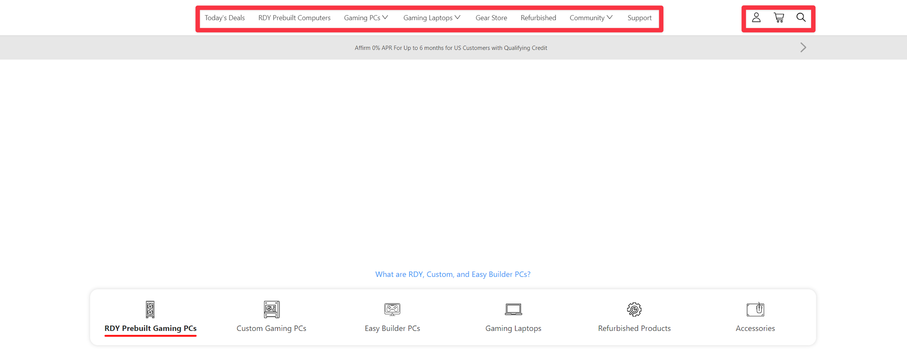
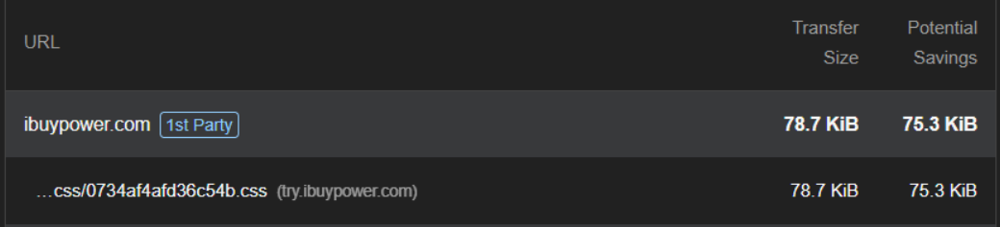
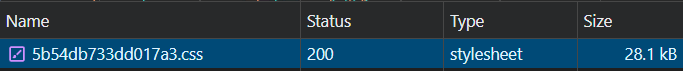
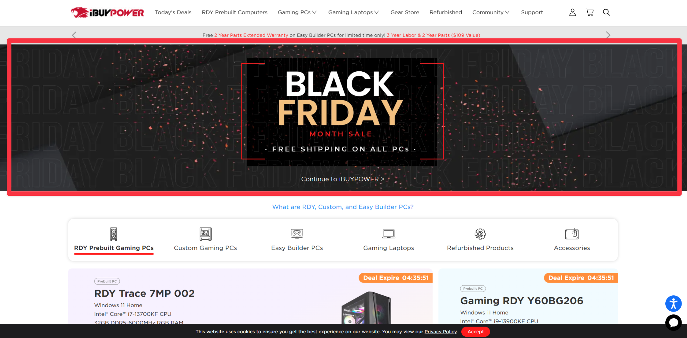
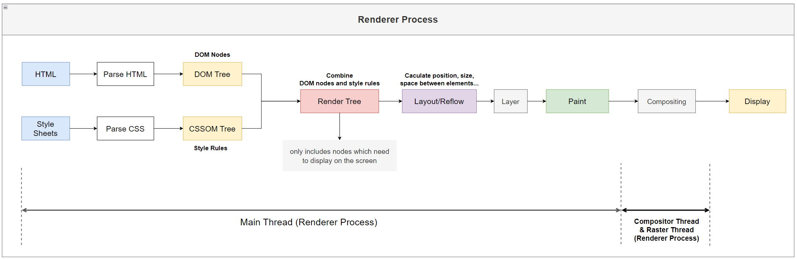
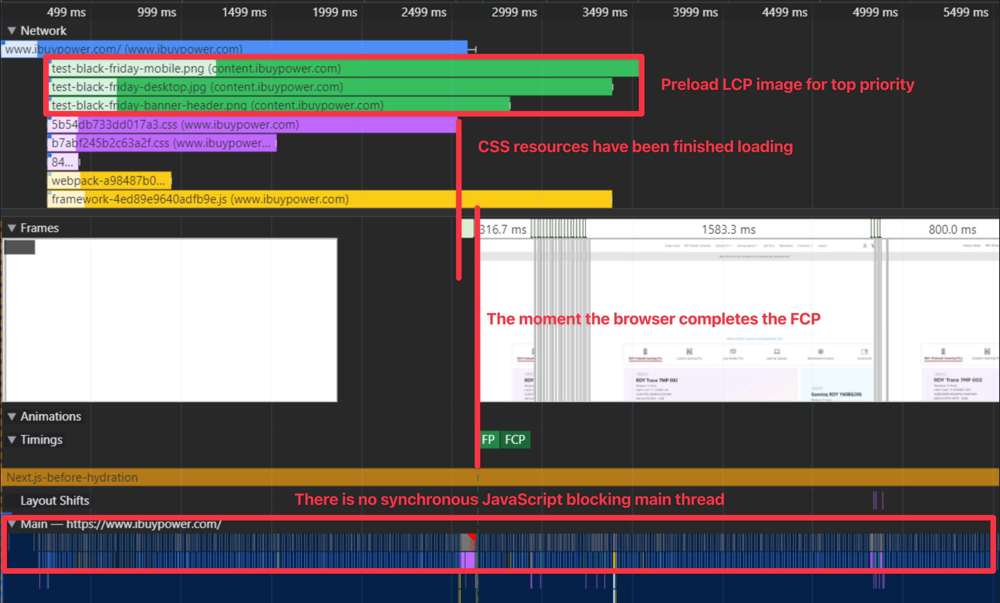
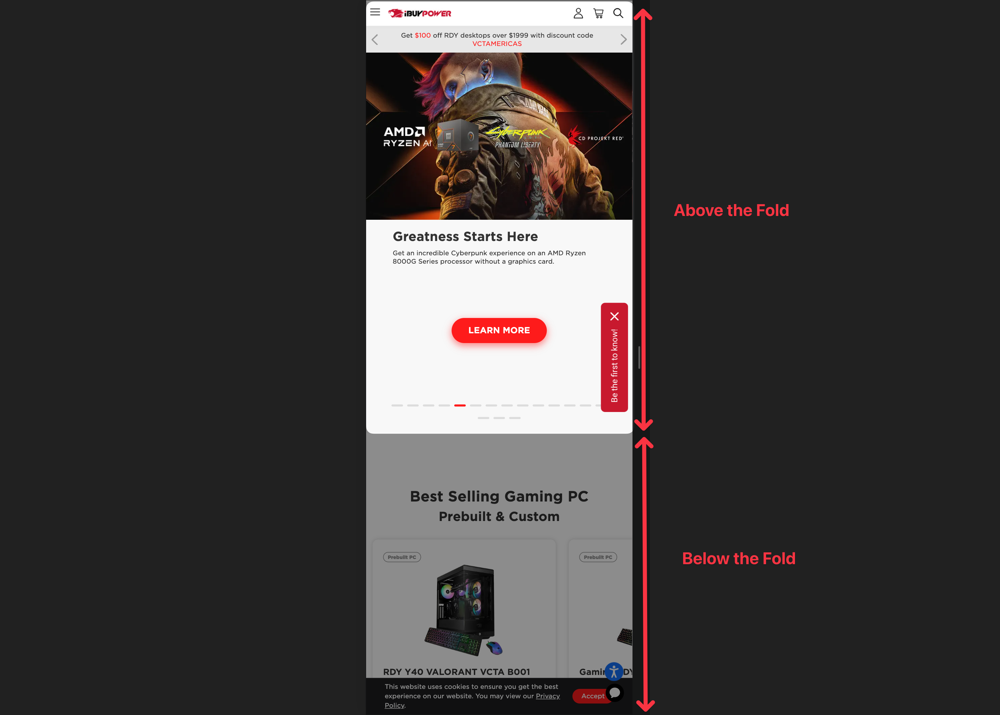
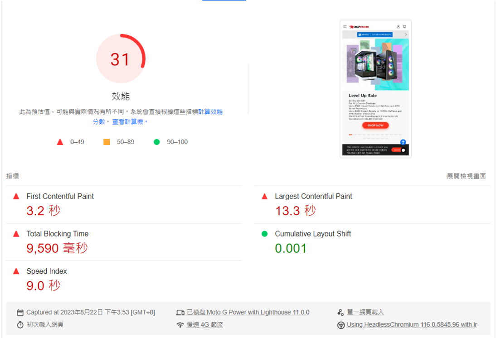
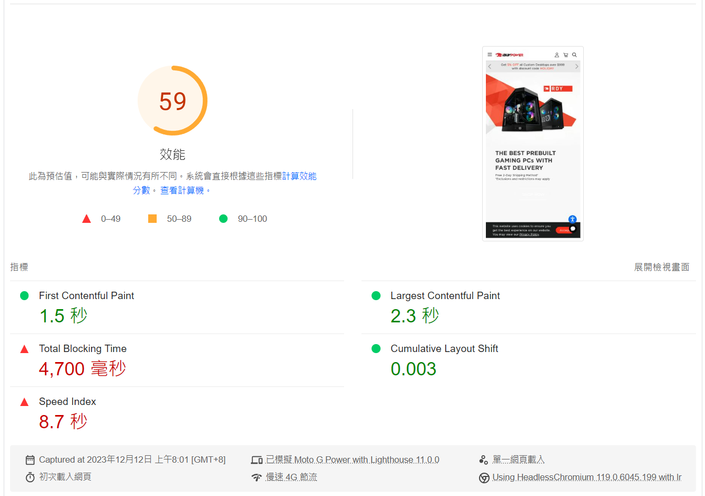

## Does page speed really matter?

Enhancing web page speed is crucial for improving user experience, conversion rates, and SEO rankings. This article explores practical strategies for optimizing Lighthouse Metrics & Optimization in web development.

<!--truncate-->

The article will discuss how to improve various Lighthouse metrics:

- FCP (First Contentful Paint)
- LCP (Largest Contentful Paint)
- CLS (Cumulative Layout Shift)
- TBT (Total Blocking Time)

## First Contentful Paint

> The time it takes from loading a webpage to displaying any content on the webpage (text, images, SVG, canvas) on the screen.



### Server Side Render

To speed up the FCP, we utilize Next.js **Server Side Render for pre-rendering HTML** instead of a SPA like React since the page content must be rendered after JavaScript execution

### Allow the browser to start rendering as soon as possible

First we need to know when does the browser begin rendering, the answer is after the browser begins parsing HTML, **it starts rendering only after the critical CSS resources have been loaded**.

So, here are our strategies:

- Remove unused CSS
- Preload CSS file
- Font display swap
- Avoid chaining critical requests
- Avoid large DOM sizes

### Remove unused CSS

In this step, we removed the redundant CSS frameworks (Bootstrap), as well as the base64 that was present in the CSS file.

**Avoid using base64 image in css file**

```scss
.icon {
    background: url('data:image/png;base64,iVBORw0KGgoAAAANSUhEUg...');
}
```

_before(~75kb)_



_after(~28kb)_



### Preload CSS

Preload important external CSS resource

```html
<link rel="preload" href="/_next/static/css/ccbfa2e8aa325369.css" as="style" />
```

### Font display swap

Show default fonts until custom fonts are fully loaded

```scss
@font-face {
  font-family: "HCo Gotham SSm";
  src: url("./woff2/GothamSSm-XLight_Web.woff2") format("woff2"), url("./woff/GothamSSm-XLight_Web.woff")
      format("woff");
  font-weight: 200;
  font-style: normal;
  font-display: swap;
}
```

### Avoid chaining critical requests(Non blocking CSS)

- _app.tsx_
  - _../styles/globals.scss_
    - _master.scss_
      - _final.scss_

app.tsx

```js
import "../styles/globals.scss";
```

globals.scss

```scss
@import "master.scss";

// styles...
```

master.scss

```scss
@import "final.scss";

// styles...
```

### Non blocking JS

In order to allow the main thread to focus on rendering tasks, we need to avoid running other unimportant tasks on the main thread.

**Defer script**

1. Without blocking main thread
2. Parallel download script in background and execute script before `DOMContentLoaded`
3. Will be executed in order

```jsx
<script defer src="third-party.js">
```

**Async script**

1. Download in the background and execute as soon as the download is complete.
2. The main thread will still be blocked during script execution.

```jsx
<script async src="third-party.js">
```

**Next.js Script Component**

- afterInteractive
- beforeInteractive
- lazyOnload
- worker

```jsx
<Script
  src={`https://www.googletagmanager.com/gtag/js?id=123`}
  strategy="afterInteractive"
/>
```

## Largest Contentful Paint

The render time of the largest [image or text block](https://web.dev/articles/lcp#what_elements_are_considered) visible within the viewport, relative to when the page [first started loading](https://w3c.github.io/hr-time/#timeorigin-attribute).

In most cases, it might be the banner section.



### Preload resources(images) that above the fold

Using preload helps here because the image starts loading ahead of time and is likely to already be there when the browser needs to display it.

```html
<link
  rel="preload"
  as="image"
  href="banner.png"
  imagesrcset="banner-400.png 400w, banner-1600.png 1600w"
  imagesizes="90vw"
/>
```

#### With Next.js

```jsx
import Image from "next/image";

<Image src="banner.png" alt="" priority={true} />;
```

### Understanding the Browser Rendering Process

By understanding the principles of browser rendering, we can know how to make the browser paint specific resources on the screen as quickly as possible.



### Loading Sequence Optimization

At this stage, we need to adjust the loading order of resources to ensure that other resources do not block browser rendering, and use the performance panel of devtools for inspection.

1. External CSS resources have been finished loading
2. There is no synchronous JavaScript
3. The largest image resources are ready
4. There are no tasks causing render or main thread blocking.
5. Awaiting the browser to render the images onto the screen.

We can confirm whether it meets our expectations by checking

- Network
- Frame
- Main



## Calculate Layout Shift

In this part, the most important thing is to _give the default width and height_ of the element

```jsx
<div className="placeholder w-[400px] h-[280px] md:w-[1600px] h-[350px]">
  // image
</div>
```

## Total Blocking Time

The most important thing is to minimize unnecessary JavaScript execution on the main thread as much as possible, as well as reducing bundle size.

### Reduce bundle size

#### Choose a lighter-weight package

```jsx
import math from "math.js"; // 1.1M(gzipped 233.9k)
import decimal from "decimal.js"; //
```

#### Dynamic import component when needed

```jsx
const MobileMenu = dynamic(() => import("./layout/mobile-menu"));
const CartView = dynamic(() => import("./cartView"));
```

#### Avoid namespace at front-end

```jsx
import * as somethingBig from "./somethingBig";

somethingBig.a();
somethingBig.b();
```

#### Avoid using "require"

Since webpack cannot perform tree shaking on required modules at the time of bundling, using ES6 import can make the frontend bundle size lighter.

utils.js

```jsx
// Even if lodash is not used, the entire module will be bundled in.
const lodash = require("lodash");

export function a() {
  return "test a";
}

// Lodash will be subjected to tree shaking during the webpack bundling process.
import lodash from "lodash";

export function a() {
  return "test a";
}
```

index.js

```jsx
import { a } from "./utils";

let foo = a();
console.log(foo);
```

### Focus on Above The Fold content

Portion of a webpage that is visible without scrolling, typically the content that appears immediately when you first load the page



### Avoid long tasks on main thread

- Reduce hydration cost
- Web Workers
  - Run third party script on web workers, without blocking main thread

### Avoid large DOM sizes

- Instead of load all content initially consider Above The Fold strategy
- Using React.Fragment

```js
document.querySelectorAll("*").length;
```

## Final Results

- Reduce app.js bundle size by 76%(from 640kb to 157kb)
- Boosted Lighthouse score 20+(mobile from 30 to 50+)
- 1.7s faster First Contentful Paint(from 3.2s to 1.5s)
- 11s faster Largest Contentful Paint(from 13.3s to 2.3s)
- Reduce 50% Total Blocking Time(from 9500ms to 4700ms)

| Metrics                  | 2023/08/08 | 2023/08/22 | 2023/11/22 | 2023/12/05 | 2023/12/12 |
| ------------------------ | ---------- | ---------- | ---------- | ---------- | ---------- |
| First Contentful Paint   | 3.0s       | 3.2s       | 1.8s       | 1.5s       | 1.5s       |
| Largest Contentful Paint | 15.0s      | 13.3s      | 2.9s       | 2.4s       | 2.3s       |
| Calculate Layout Shift   | 0.134      | 0.01       | 0.01       | 0          | 0.001      |
| Total Blocking Time      | -          | 9500ms     | 8000ms     | 6370       | 4700       |
| \_app bundle size(kb)    | -          | 639        | 238        | 174        | 157        |
| Unused CSS(kb)           |            | 75         | 25         | 25         | 25         |
| Score                    | x          | 31         | 56         | 63         | 59         |

2023-08-22


2023-12-12


## Ref

[Does page speed really matter?](https://qwik.builder.io/docs/concepts/think-qwik/#does-page-speed-really-matter)

[Optimize LCP](https://web.dev/articles/optimize-lcp#lcp_breakdown)

[A deep dive into optimizing LCP](https://www.youtube.com/watch?v=fWoI9DXmpdk)

[How large DOM sizes affect interactivity, and what you can do about it](https://web.dev/articles/dom-size-and-interactivity)
